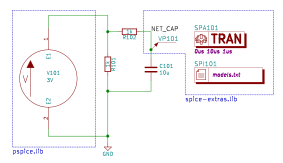

## kicad-spice-extras

kicad-spice-extras is a tool that allows to export a Kicad EESchema schematic to a SPICE-compatible netlist. It consists of a XSL transformation script and a set of helper components. These components allow to generate a number of SPICE simulation commands automatically based on schematic. 

### Usage

1. Create a schematic
2. Place a simulation controller component and modify its attributes
3. Place probes
4. If needed, place an “include” component
5. Export the schematic using the provided transformation script
6. Run the resulting netlist through a SPICE simulator of you choice

### Tool support

The generated netlist is compatible with Tina (incl. Tina-TI), Orcad PSpice and Xyce.
